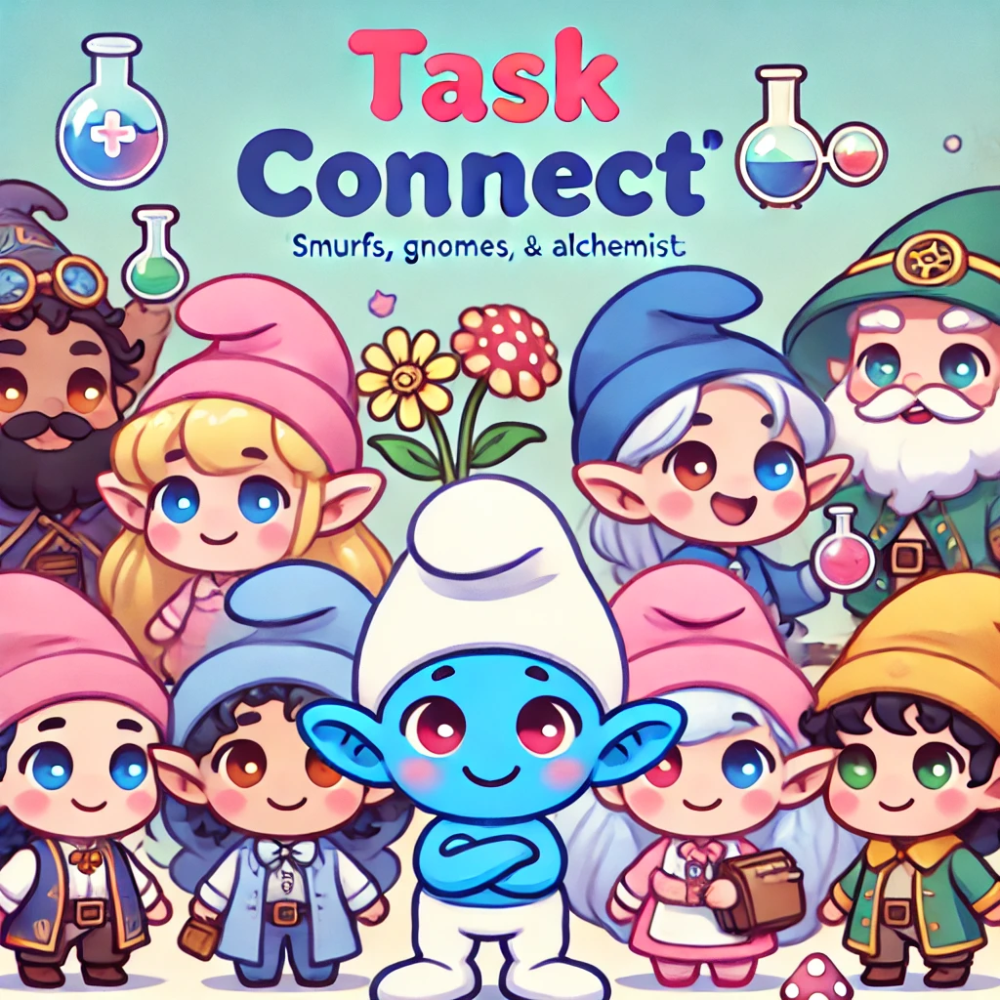

# Task Connect

Task Connect is a task management application with gamification features that include elements like alchemists and gnomes. It supports both web and mobile platforms using Angular and Ionic.

<div align="center">
  
</div>

## Code sharing between Desktop and Mobile applications

### Task Connect Web and Task Connect Mobile

Task Connect provides seamless code sharing between web and mobile platforms, with different approaches, while ensuring consistent user experiences across devices.

<table>
  <tr>
    <td>
      
    </td>
    <td>
      
    </td>
  </tr>
</table>

## Application Features

- **Client Management**: Create, update, delete, and view tasks.
- **Task Management**: Create, update, delete, view and filter tasks. Associate tasks with specific clients.
<!-- - **Gamification**: Users are represented by avatars, including alchemists and gnomes. -->

## Installation

### Prerequisites

Ensure you have the following installed:

- **Node.js** (version ^18.19.1, ^20.11.1, or ^22.0.0)
  <!-- - **Angular CLI** (latest version) -->
  <!-- - **Ionic CLI** (latest version) -->

### Steps

1. **Clone the Repository**

   ```bash
   git clone https://github.com/jurfest/nx-ng-ionic
   cd task-connect
   ```

2. **Install Dependencies**

   ```bash
   npm install
   ```

3. **Run JSON Server**

   Task Connect uses `json-server` to mock backend data. Run the following command in a terminal:

   ```bash
   npm run start:json-server
   ```

4. **Run the Application**

   While running the server, in parallel, in another terminal, run the Web and/or the Mobile application.

   For Web:

   ```bash
   npm start
   ```

   For Mobile:

   ```bash
   npm run start:mobile
   ```

5. **Access the Application**

   - Web: Open `http://localhost:4200` in your browser.
   - Mobile: Open `http://localhost:8100` in your browser. For a better experience, choose iOS or Android dimensions in Chrome Dev Tools device toolbar - after choose a device, reload the page (f5) to view layout variations.

## Usage

### Web Version

1. **Dashboard**: View a list of all tasks and their statuses.
2. **Add/Update Task**: Click on "Add Task" to create a new task or click on an existing task to update it. A modal will appear where you can fill in the task details and associate it with a user.
3. **Filter Tasks**: Use the filter options to view tasks by their status.
4. **Sort Tasks**: Sort tasks by their due dates.

### Mobile Version

1. **Task List**: Similar to the web version, you can view, add, update, and delete tasks on your mobile device.
2. **Navigation**: Use the Ionic navigation features to move between different sections of the app.

## Technologies Used

- **Angular 18**: For building the web application.
- **Ionic 8**: For building the mobile application.
- **Tailwind CSS and Angular Material**: For styling components with a responsive design.
- **json-server**: For mocking the backend API.
- **NgRx**: For state management.
- **Nx**: For managing the monorepo and ensuring scalable code architecture.
- **Server-Side Rendering**: For improved performance and SEO on the web.
- **RxJS**: For reactive programming and managing asynchronous data streams.

## License

This project is licensed under the MIT License. See the [LICENSE](LICENSE) file for details.

## Aditional information about the Nx Ng Ionic monorepo

<a alt="Nx logo" href="https://nx.dev" target="_blank" rel="noreferrer"></a>

✨ **This workspace has been generated by [Nx, Smart Monorepos · Fast CI.](https://nx.dev)** ✨

## Integrate with editors

Enhance your Nx experience by installing [Nx Console](https://nx.dev/nx-console) for your favorite editor. Nx Console
provides an interactive UI to view your projects, run tasks, generate code, and more! Available for VSCode, IntelliJ and
comes with a LSP for Vim users.

## Nx plugins and code generators

Add Nx plugins to leverage their code generators and automated, inferred tasks.

```
# Add plugin
npx nx add @nx/react

# Use code generator
npx nx generate @nx/react:app demo

# Run development server
npx nx serve demo

# View project details
npx nx show project demo --web
```

Run `npx nx list` to get a list of available plugins and whether they have generators. Then run `npx nx list <plugin-name>` to see what generators are available.

Learn more about [code generators](https://nx.dev/features/generate-code) and [inferred tasks](https://nx.dev/concepts/inferred-tasks) in the docs.

## Running tasks

To execute tasks with Nx use the following syntax:

```
npx nx <target> <project> <...options>
```

You can also run multiple targets:

```
npx nx run-many -t <target1> <target2>
```

..or add `-p` to filter specific projects

```
npx nx run-many -t <target1> <target2> -p <proj1> <proj2>
```

Targets can be defined in the `package.json` or `projects.json`. Learn more [in the docs](https://nx.dev/features/run-tasks).

## Set up CI!

Nx comes with local caching already built-in (check your `nx.json`). On CI you might want to go a step further.

- [Set up remote caching](https://nx.dev/features/share-your-cache)
- [Set up task distribution across multiple machines](https://nx.dev/nx-cloud/features/distribute-task-execution)
- [Learn more how to setup CI](https://nx.dev/recipes/ci)

## Explore the project graph

Run `npx nx graph` to show the graph of the workspace.
It will show tasks that you can run with Nx.

- [Learn more about Exploring the Project Graph](https://nx.dev/core-features/explore-graph)

## Connect with us!

- [Join the community](https://nx.dev/community)
- [Subscribe to the Nx Youtube Channel](https://www.youtube.com/@nxdevtools)
- [Follow us on Twitter](https://twitter.com/nxdevtools)
